## :sun_with_face: SUN 

> **"SUN"**은 어린 학생들을 가르치는 과외 선생님을 위한 모바일 UI 기반의 캘린더 기반의 학습관리 웹 서비스입니다.

### :man_technologist: 팀원 소개

- 5명

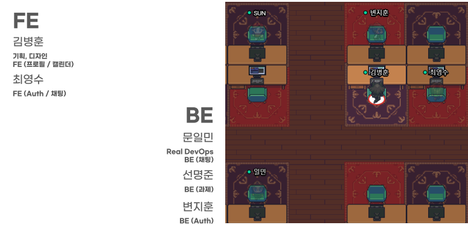

### :calendar: 개발 기간

- 2021년 10월 11일 ~ 2021년 11월 19일 (6주)

###  :open_file_folder: 서비스

#### :movie_camera: UCC

- ucc video

#### :scroll: Pages

##### 1. 로그인

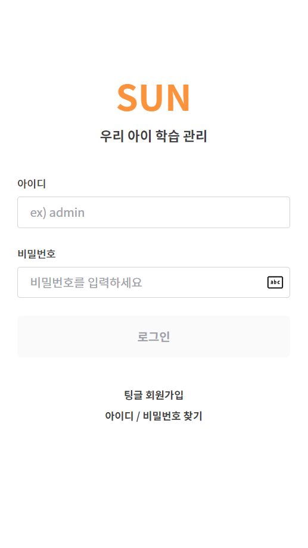

##### 2. 회원가입

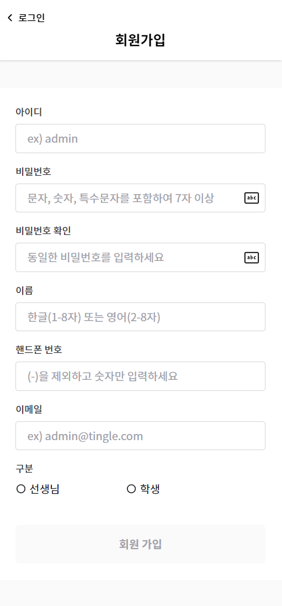

##### 3. 아이디 / 비밀번호 찾기

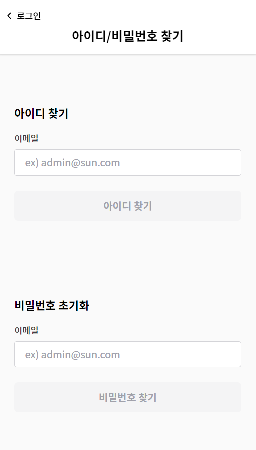

##### 4. 프로필

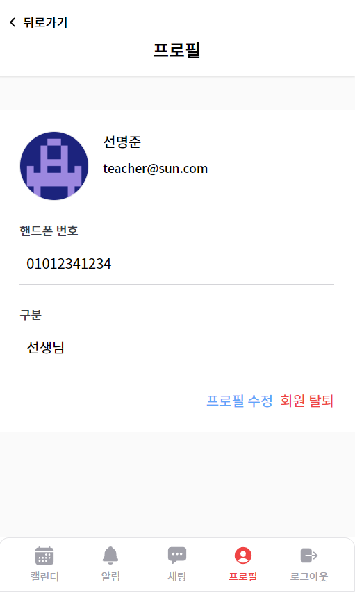

##### 5. 프로필 수정

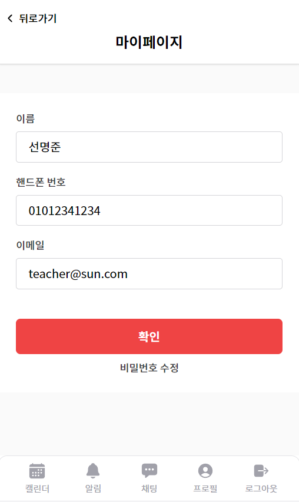

##### 6. 비밀번호 수정

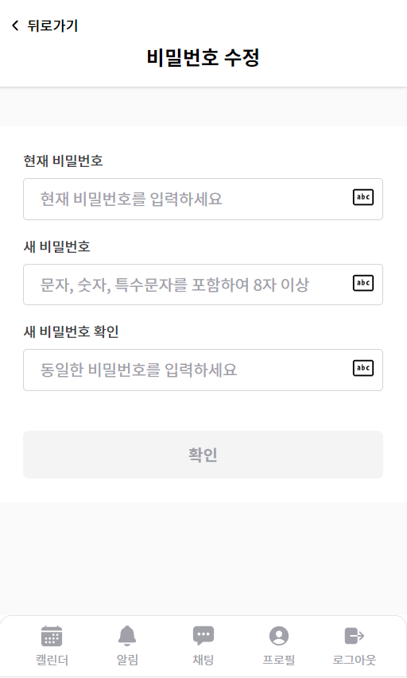

##### 7. 캘린더

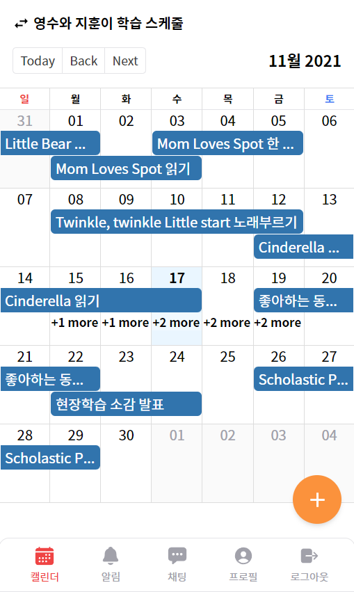

##### 8. 캘린더 목록

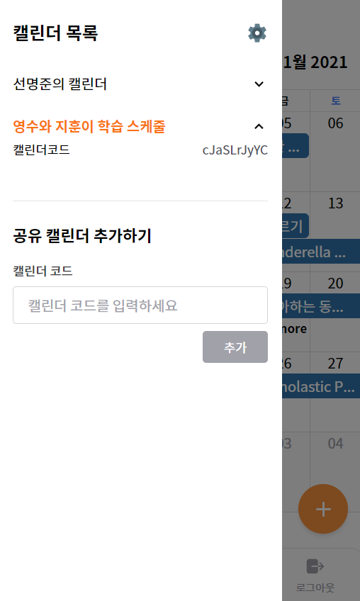

##### 9. 캘린더 관리

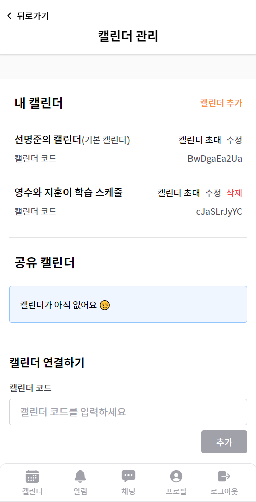

##### 10. 캘린더 디테일 Modal (과제)

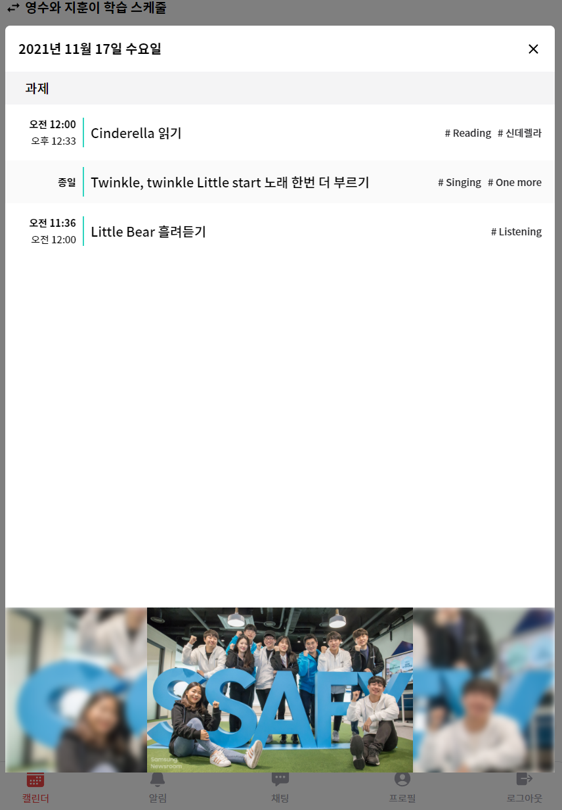

##### 11. 과제별 채팅

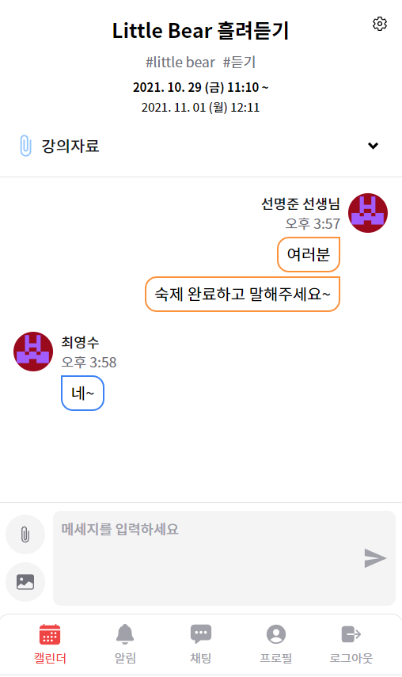

##### 12. 알림

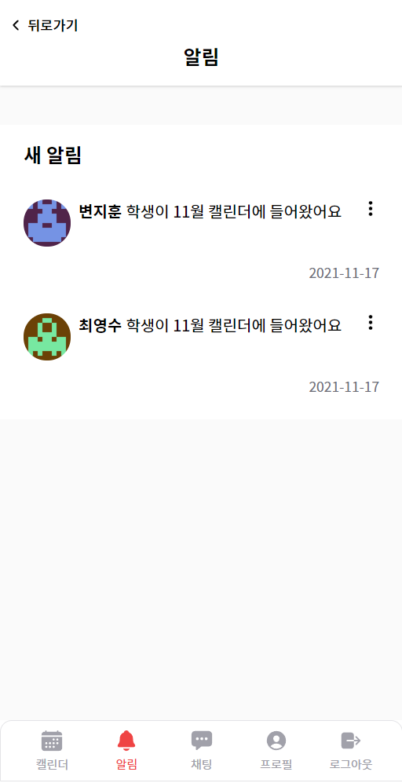

##### 13. 채팅 알림

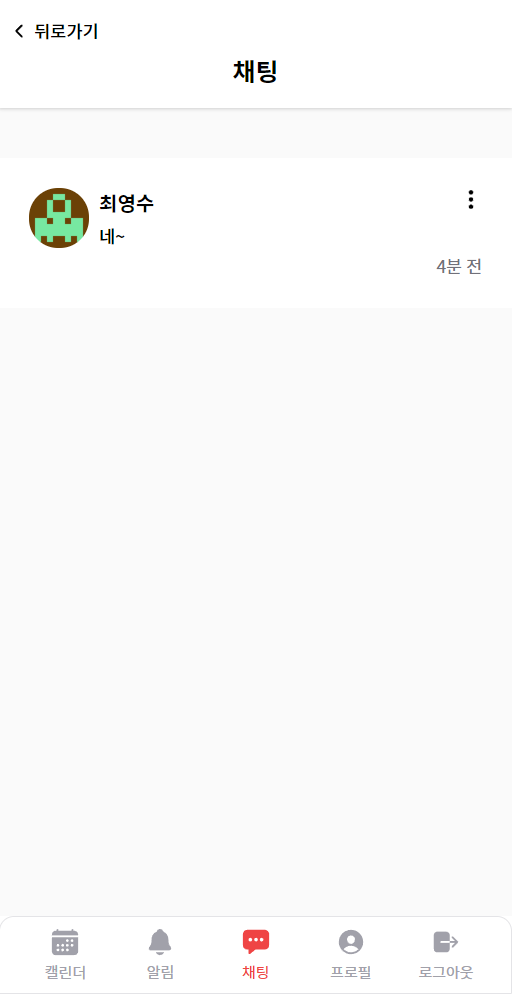

### :building_construction: 서비스 구조

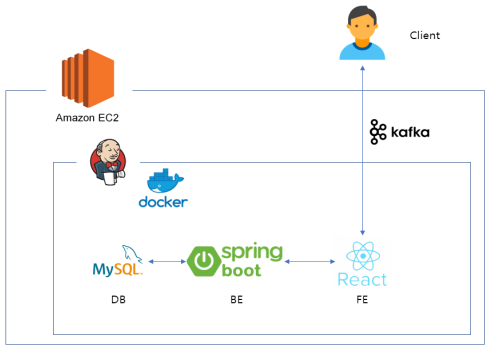

###  :computer: 기술스택

#### FE

- HTML
- CSS, SCSS
- JavaScript
- React
- SWR
- SockJS, STOMP client

#### BE

- Spring boot
- MySQL
- Redis
- JPA
- JWT
- WebSocket
- Kafka
- S3

#### Infra

- AWS EC2
- Docker
- Nginx
- Kubernetes

### :hammer_and_wrench: 협업 툴

- Gitlab
- Jira
- Notion
- Gather Town

